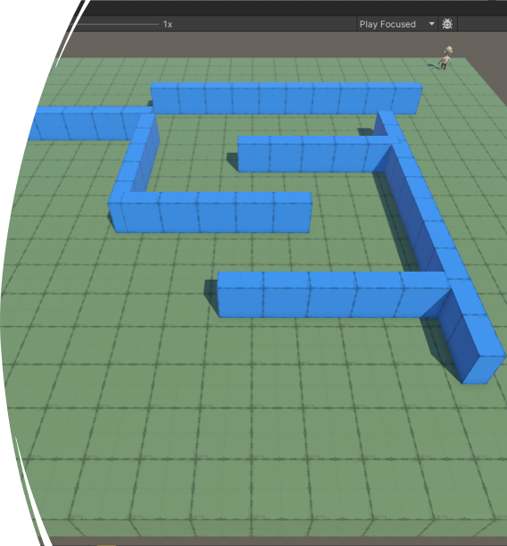
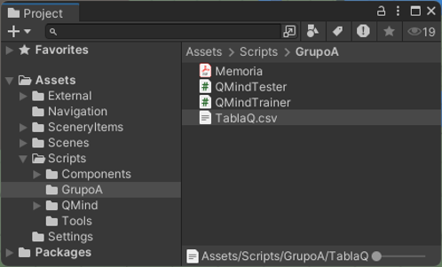
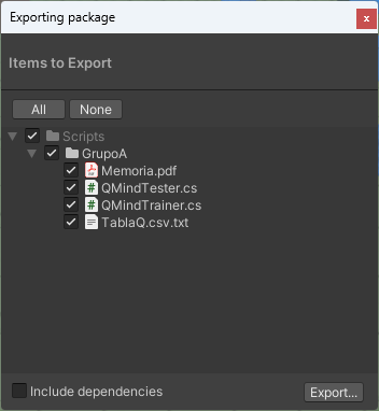
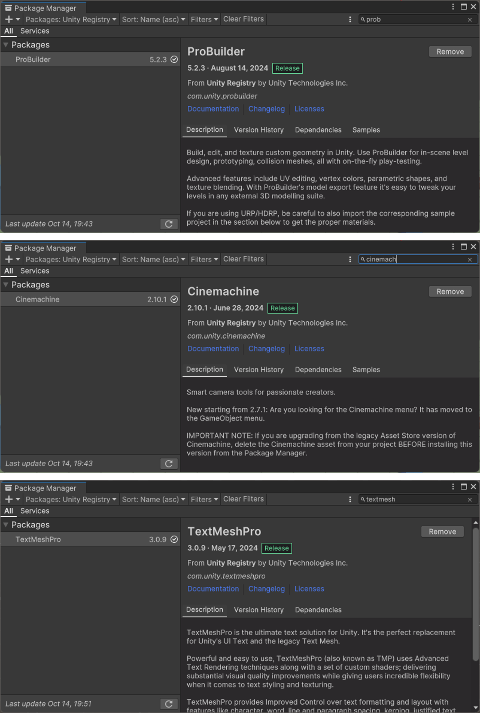
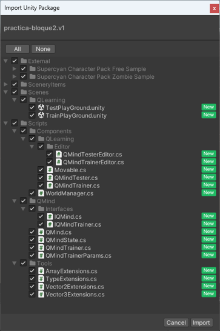
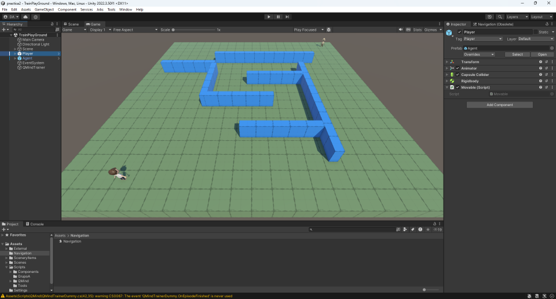
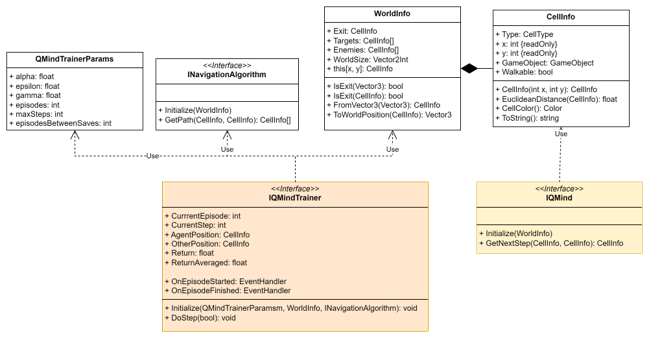

# Práctica 2: Machine Learning con Q-Learning

### Asignatura: Desarrollo de Juegos con Inteligencia Artificial (DJIA)

Este proyecto tiene como objetivo implementar un agente inteligente que aprenda a evitar ser atrapado por un oponente controlado por un algoritmo A*. 
Se utilizarán técnicas de **Q-Learning** para entrenar al agente y evaluar su rendimiento en diferentes escenarios.

## Resumen de la Práctica

El objetivo de esta práctica es implementar un agente inteligente cuyo comportamiento sea aprendido mediante técnicas de **Q-Learning**. Se utilizará el motor de videojuegos **Unity™** junto con su lenguaje de scripting **C#**. El proyecto debe permitir al agente aprender a evitar a un oponente a través de entrenamiento y pruebas en diferentes escenarios.

## Objetivos

- Implementar un agente inteligente que aprenda a escapar de un oponente controlado por un algoritmo A*.
- Utilizar técnicas de **Q-Learning** para entrenar al agente.
- Probar la eficacia del agente en una escena de test con diferentes escenarios y medir su rendimiento.

## Evaluación

- Se realizarán **10 ejecuciones de prueba** para medir el rendimiento del agente. Se contará el número de pasos realizados por el agente sin ser atrapado.
- La calificación se basará en el promedio de pasos conseguidos:
    - **250-1000 pasos**: 6 puntos
    - **1000-5000 pasos**: 8 puntos
    - **Más de 5000 pasos**: 10 puntos

## Forma de Entrega

1. **Originalidad**:
    - Se pueden utilizar librerías externas para apoyar el programa general, pero la implementación del agente y los algoritmos de búsqueda deben ser creados desde cero.

2. **Documentación**:
    - Se debe presentar un informe donde se describa el contexto del juego, los problemas planteados a la IA, los algoritmos implementados, qué controles tienen los algoritmos y qué valores se les han dado.
    - El código fuente debe estar debidamente comentado.

3. **Funcionalidad**:
    - Los algoritmos deben poder ejecutarse sin errores dentro de un proyecto base.

## Estructura del Proyecto

- El proyecto debe crearse en una subcarpeta de la carpeta `Scripts` denominada `Grupo<letra>` donde `<letra>` es la letra asignada al grupo. Ejemplo: `GrupoA`.
- Dentro de esta carpeta se incluirán:
    - Todas las clases y archivos fuente necesarios para la ejecución del programa. 
    - La memoria del proyecto. 
    - **Tabla Q**: La tabla de valores **Q** generada durante el entrenamiento, almacenada en formato CSV. Esta tabla se utiliza para guiar al agente durante la fase de test.

- Todas las clases deben situarse dentro de un **namespace** con el mismo nombre que la carpeta (`namespace GrupoA`).

 

- El proyecto se exportará en forma de un **package de Unity** denominado `Grupo<letra>.unitypackage`.
- Se deben subir **dos archivos** al aula virtual:
    1. El paquete generado (`GrupoA.unitypackage`).
    2. Un archivo de texto llamado `codigo_fuente.txt` con todo el código fuente.

## Instalación del Entorno Unity

- Crear un proyecto nuevo en **Unity** versión **2022.3.30f1**, de tipo **Universal 3D/3D (URP)**.
- Instalar los siguientes paquetes utilizando el **Package Manager** de Unity:
    - **Probuilder**
    - **CineMachine**
    - **TextMeshPro** (o actualizar a la versión más reciente)

## Carga del unity package

- Sobre el proyecto creado se debe cargar el **unity package** correspondiente a la práctica.

## Entorno de la Práctica

- **Scenes/QLearning:** Incluye dos escenas principales:
    - **TrainPlayGround**: Escena donde se realiza el entrenamiento del agente inteligente.
    - **TestPlayGround**: Escena de prueba para evaluar el rendimiento del agente tras el entrenamiento.

### TrainPlayGround

En la escena TrainPlayGround es donde se realizará el entrenamiento de nuestro agente. Dentro
de este mundo podemos encontrar los siguientes elementos de juego:
1. El agente inteligente, representado por el game object Agent. Es el personaje controlado por
   la IA y objeto de la práctica.

2. El rival de nuestro agente inteligente, representado por el game object Player. Este rival se
   desplazará hacia la posición del agente inteligente usando un algoritmo A*.

3. El game object QMindTrainer contiene el script homónimo que entrena a nuestro agente. Es-
   te script utiliza una implementación de la interfaz IQMindTrainer que puede seleccionarse en
   el inspector. En el proyecto base, la implementación seleccionada es QMindTrainerDummy,
   una implementción básica de ejemplo.

4. El escenario de juego, representado por el game object Scenery. Los objetos del mundo son
   game objects hijos de este. La escena incluye:
   a) El suelo/tablero, representado por el game object Floor en color verde. Está construido
   en forma de bloque rectangular y tiene un tamaño de 20x20 unidades.
   b) Obstáculos, representados por los game objects Wall (*) en color azul.

## Implementación del código

1. **Entrenamiento del Agente**: Programar la interfaz `IQMindTrainer` para entrenar al agente (Agent) a evitar ser atrapado por el rival (Player) en la escena **TrainPlayGround**.
2. **Pruebas del Agente**: Implementar la interfaz `IQMind` para evaluar el rendimiento del agente en la escena **TestPlayGround**, con obstáculos y posiciones de inicio aleatorios.

## Requisitos para Aprobar

- El agente debe ser funcional y capaz de escapar del oponente en el entorno de prueba.
- La tabla **Q** debe ser generada correctamente durante el entrenamiento y revisable en formato **CSV**.
- La práctica debe ser original, funcional y estar debidamente documentada.

## Licencia MIT

Este proyecto se distribuye bajo la licencia MIT.

--- 
MIT License

Copyright (c) 2023 David María Arribas

Permission is hereby granted, free of charge, to any person obtaining a copy
of this software and associated documentation files (the "Software"), to deal
in the Software without restriction, including without limitation the rights
to use, copy, modify, merge, publish, distribute, sublicense, and/or sell
copies of the Software, and to permit persons to whom the Software is
furnished to do so, subject to the following conditions:

The above copyright notice and this permission notice shall be included in all
copies or substantial portions of the Software.

THE SOFTWARE IS PROVIDED "AS IS", WITHOUT WARRANTY OF ANY KIND, EXPRESS OR
IMPLIED, INCLUDING BUT NOT LIMITED TO THE WARRANTIES OF MERCHANTABILITY,
FITNESS FOR A PARTICULAR PURPOSE AND NONINFRINGEMENT. IN NO EVENT SHALL THE
AUTHORS OR COPYRIGHT HOLDERS BE LIABLE FOR ANY CLAIM, DAMAGES OR OTHER
LIABILITY, WHETHER IN AN ACTION OF CONTRACT, TORT OR OTHERWISE, ARISING FROM,
OUT OF OR IN CONNECTION WITH THE SOFTWARE OR THE USE OR OTHER DEALINGS IN THE
SOFTWARE.
--- 